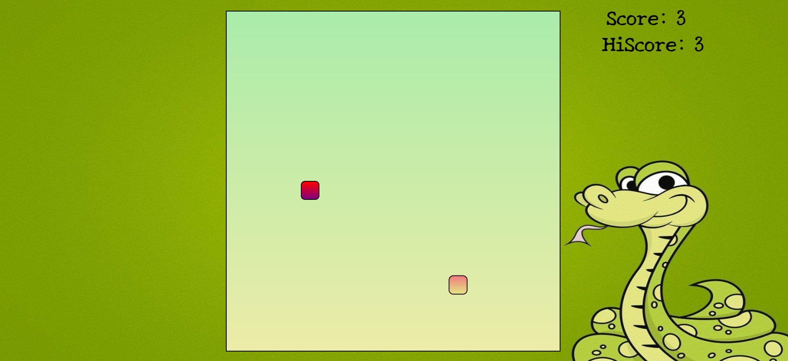

# Snake Game

This is a classic Snake Game implemented using HTML, CSS, and JavaScript. It's a fun and addictive game where the player controls a snake that grows longer as it eats food on the game board. The objective is to eat as much food as possible without colliding with the walls or the snake's own body.

## Features

- **Responsive Design**: The game is designed to work on various screen sizes, from desktop to mobile devices.
- **Simple Controls**: Use the arrow keys to control the direction of the snake (up, down, left, right).
- **Score Tracking**: The game keeps track of your score based on the number of food items eaten.
- **Game Over**: The game ends if the snake collides with the walls or itself. Your high score is saved.
- **Smooth Animations**: Enjoy smooth animations and transitions for a better gaming experience.

## How to Play

1. Open the `index.html` file in your web browser.
2. Use the arrow keys on your keyboard to control the snake's direction.
3. Move the snake to eat the food on the game board.
4. The snake will grow longer with each food item eaten.
5. Avoid colliding with the walls or the snake's body.
6. Try to achieve the highest score possible!

## Demo

A live demo of the Snake Game is available [here](https://pandeydhruv2001.github.io/Snake-Game/).

## Installation

To run the Snake Game locally, follow these steps:

1. Clone the repository: `git clone https://github.com/yourusername/snake-game.git`
2. Navigate to the project directory: `cd snake-game`
3. Open the `index.html` file in your preferred web browser.

## Technologies Used

- HTML5
- CSS3
- JavaScript

## Credits

- The Snake Game logic and design are inspired by various online tutorials and resources.

## License

This project is licensed under the [MIT License](LICENSE).

## Contact

For any inquiries or suggestions, please contact [dp0689@srmist.edu.in](mailto:your@email.com).

Feel free to contribute to the project by submitting pull requests or creating issues.

Have fun playing the Snake Game!
